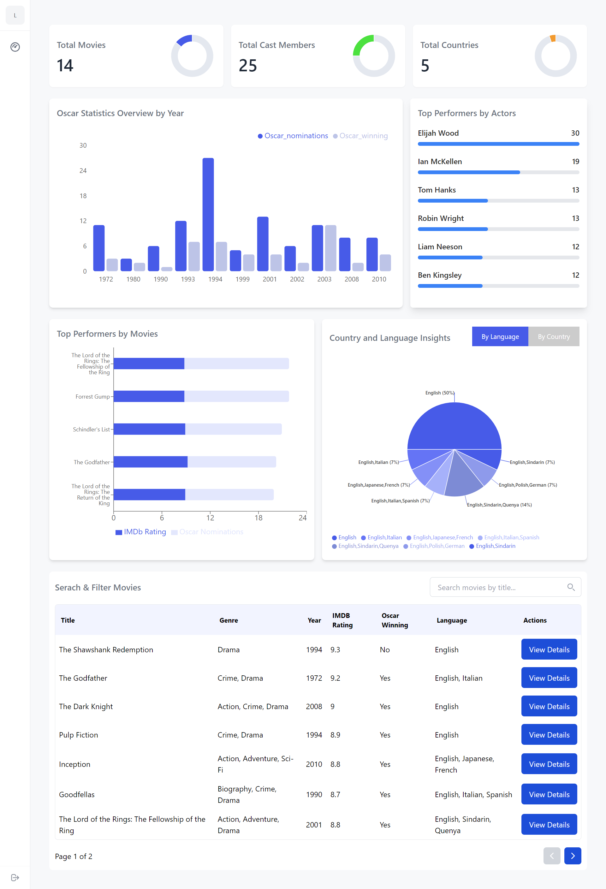

# Movie Dashboard

## Description
A movie dashboard assignment built with React using Vite and tailwind css.

## Requirements
- Node.js (LTS version)
- npm (comes with Node.js)

## Installation

1. Clone the repository:
   ```bash
   git clone https://github.com/zainchohan/movie_dashboard.git

2. Navigate into the project folder:
    ```bash
   cd movie_dashboard

3. Navigate into the project folder:
    ```bash
   npm install

## Run the Project

To start the development server, run the following command:
1. Navigate into the project folder:
    ```bash
   npm run dev

Then project will be accessible at http://localhost:5173 by default.

## Running Tests

1. To run the tests for the project, use the following command:
    ```bash
   npm test

## Project Screenshots

Below is a screenshot of the project:

